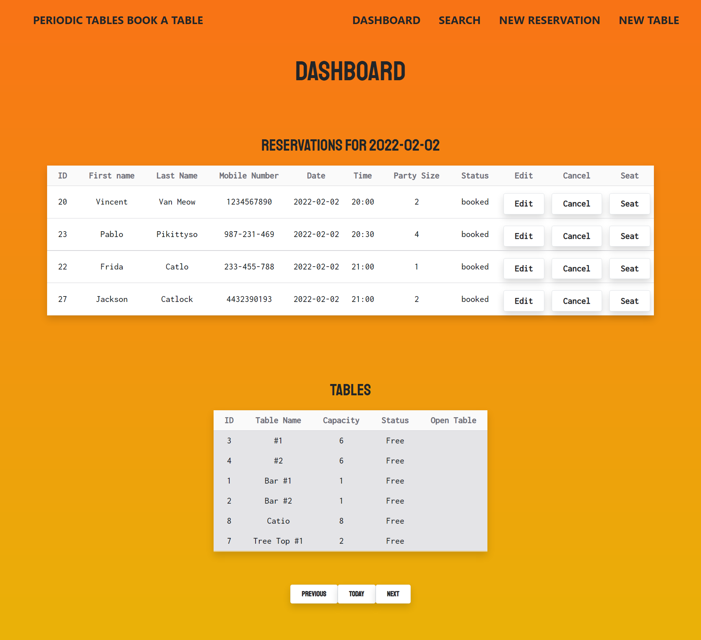
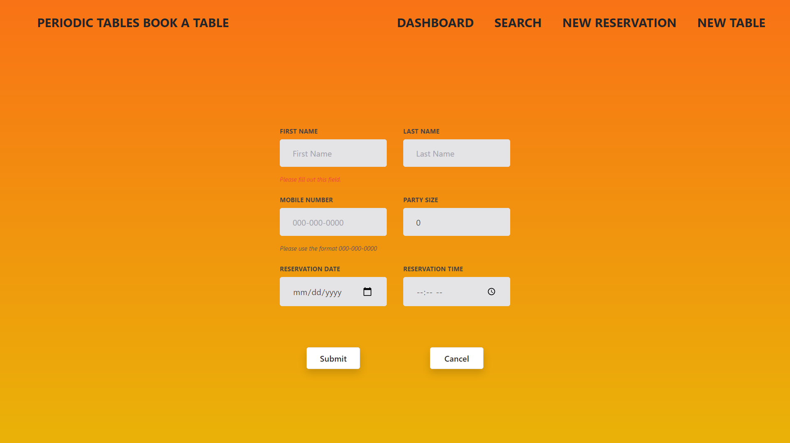
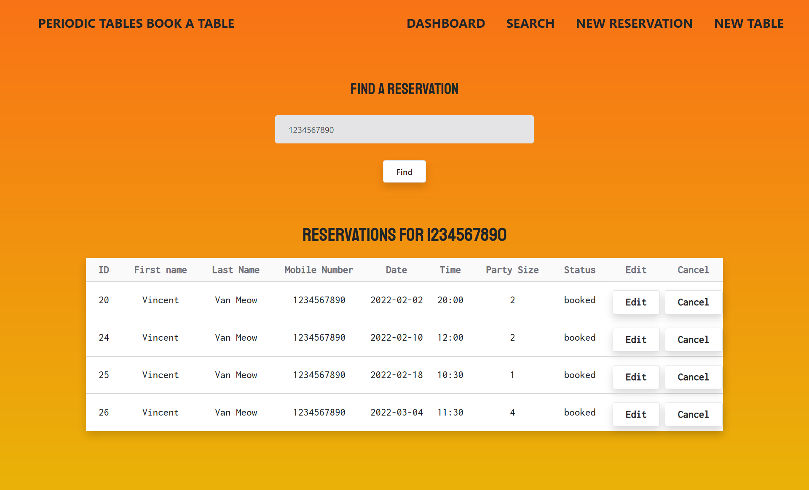
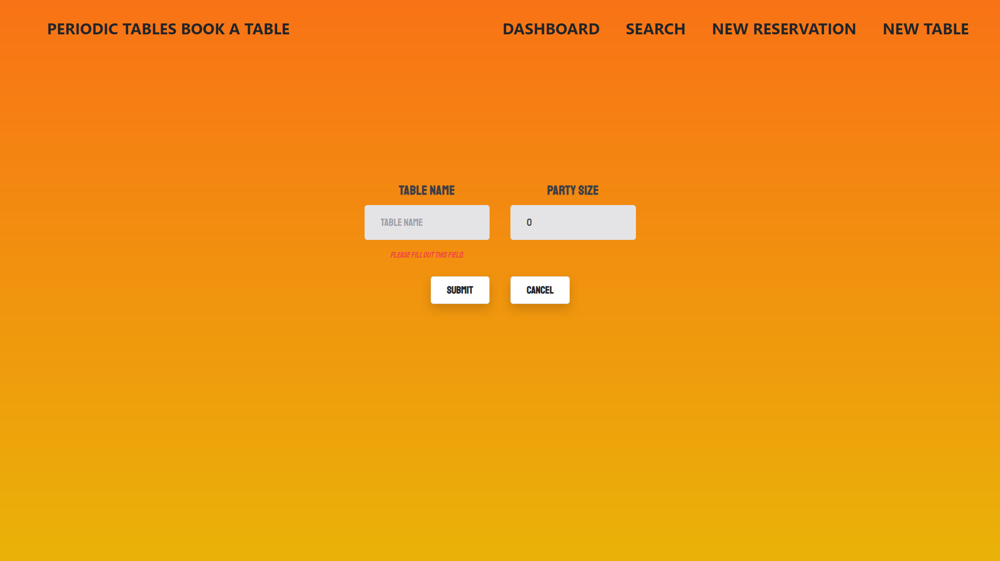

# <div align="center" >Book a Table Application </div>

## Full-stack application to track restaurant tables and reservations.

<br>

## Table of Contents

- [Summary](#Summary)
- [User Guide](#User-Guide)
- [API Documentation](#API-Documentation)
- [Technologies](#Technologies)
- [Installation](#Installation)
- [Questions](#Questions)
  <br>

## Summary

#### Allows users to view reservations by day, create new reservations, edit existing reservations, assign a reservation to a table, cancel a reservation, and search for reservations by phone number.

<br>

#### This application was built with React, Node, Express, PostgreSQL, and Tailwind CSS. Development of this application involved turning user stories into features and tracking progress through daily stand-ups and agile project management tools -- [view the project board](https://github.com/users/lindseyindev/projects/4).

<br>

|                         <div style="width:250px"> API </div>                         |                           <div style="width:250px"> Client                            |
| :----------------------------------------------------------------------------------: | :-----------------------------------------------------------------------------------: |
| [GitHub](https://github.com/lindseyindev/restaurant-reservations/tree/main/back-end) | [GitHub](https://github.com/lindseyindev/restaurant-reservations/tree/main/front-end) |
|               [Deployed on Heroku](https://book-a-seat.herokuapp.com/)               |            [Deployed on Vercel](https://book-a-table.vercel.app/dashboard)            |

<br>

## User Guide

<br></br>

### The Dashboard displays all current reservations by day with the default set to today's date. The dashboard also shows current tables in the restaurant with a corresponding status. From the dashboard there are links or buttons attached to each reservation and table allowing users to modify reservations, assign reservations to a table, clear a reservation from a table, or cancel a reservation.



<br></br>

### The new reservation form allows users to add reservation details to the database. Once a reservation is added the user is redirected to the dashboard for the date of that reservation so they can see the newly added details.


<br></br>

### The search page allows users to input a phone number and return a list of all reservations that have been made under that phone number.


<br></br>

### The create table page allows users to add a new table to the database with a corresponding name and capacity field.



<br>

## API Documentation

| Route                                    | Method | Status Code | Description                                                                         |
| :--------------------------------------- | :----- | :---------- | :---------------------------------------------------------------------------------- |
| /reservations                            | POST   | 201         | Creates a new reservation                                                           |
| /reservations?date=####-##-##            | GET    | 200         | Returns a list of reservations that match the date in the query parameters          |
| /reservations?mobile_number=xxx-xxx-xxxx | GET    | 200         | Returns a list of reservations that match the mobile number in the query parameters |
| /reservations/:reservation_id            | GET    | 200         | Returns the reservation that matches the id in the parameters                       |
| /reservations/:reservation_id            | PUT    | 200         | Updates fields for the reservation that matches the ID in the parameters            |
| /reservations/:reservation_id/status     | PUT    | 200         | Updates the status of the reservation for the given ID                              |
| /tables                                  | GET    | 200         | Returns a list of tables                                                            |
| /tables                                  | POST   | 201         | Creates a new table                                                                 |
| /tables/:table_id/seat                   | PUT    | 200         | Assigns a reservation_id to the table that matches the ID in the parameters         |
| /tables/:table_id/seat                   | DELETE | 200         | Removes the reservation ID from the table and updates the status to be unoccupied   |

### Making a GET request to /reservations?date=2022-02-02 will return: 
```{
    "data": [
        {
            "reservation_id": 28,
            "first_name": "Jackson",
            "last_name": "Catlock",
            "mobile_number": "12345688967",
            "reservation_date": "2022-02-03T08:00:00.000Z",
            "reservation_time": "12:00:00",
            "people": 1,
            "status": "booked",
            "created_at": "2022-02-02T20:12:55.109Z",
            "updated_at": "2022-02-02T20:12:55.109Z"
        }
    ]
}
```

### Making a GET request to the /tables route will return: 
```{
    "data": [
        {
            "table_id": 3,
            "table_name": "#1",
            "capacity": 6,
            "reservation_id": null,
            "created_at": "2022-01-24T15:11:25.529Z",
            "updated_at": "2022-01-24T15:11:25.529Z"
        },
        {
            "table_id": 4,
            "table_name": "#2",
            "capacity": 6,
            "reservation_id": null,
            "created_at": "2022-01-24T15:11:25.529Z",
            "updated_at": "2022-01-24T15:11:25.529Z"
        },
        {
            "table_id": 1,
            "table_name": "Bar #1",
            "capacity": 1,
            "reservation_id": null,
            "created_at": "2022-01-24T15:11:25.529Z",
            "updated_at": "2022-01-24T15:11:25.529Z"
        },
        {
            "table_id": 2,
            "table_name": "Bar #2",
            "capacity": 1,
            "reservation_id": null,
            "created_at": "2022-01-24T15:11:25.529Z",
            "updated_at": "2022-01-24T15:11:25.529Z"
        },
        {
            "table_id": 8,
            "table_name": "Catio",
            "capacity": 8,
            "reservation_id": null,
            "created_at": "2022-02-02T20:02:55.354Z",
            "updated_at": "2022-02-02T20:02:55.354Z"
        },
        {
            "table_id": 7,
            "table_name": "Tree Top #1",
            "capacity": 2,
            "reservation_id": null,
            "created_at": "2022-02-02T20:02:34.831Z",
            "updated_at": "2022-02-02T20:02:34.831Z"
        }
    ]
} 
```

<br></br>

## Technologies

- React
- Node.js
- Express.js
- Knex.js
- Tailwind CSS
- PostgreSQL
- JavaScript
- HTML
- CSS
- Vercel
- Heroku
<br></br>
## Installation
<br></br>

#### Backend:

1. Navigate to the back-end folder and install dependencies using `npm install`
2. Add PostgreSQL database credentials to your environment, a sample .env file is available to reference.
3. Migrate and seed tables using `npx knex migrate:make` and `npx knex seed:run`
4. Start locally using `npm run start`

#### Frontend:

1. Navigate to the front-end folder and install dependencies using `npm install`
2. Ensure that your backend URL is referenced correctly in your environment, there is a sample .env file available to reference.
3. Start locally using `npm run start`
<br></br>

## Questions
Questions? Reach out at [github.com/lindseyindev](github.com/lindseyindev)